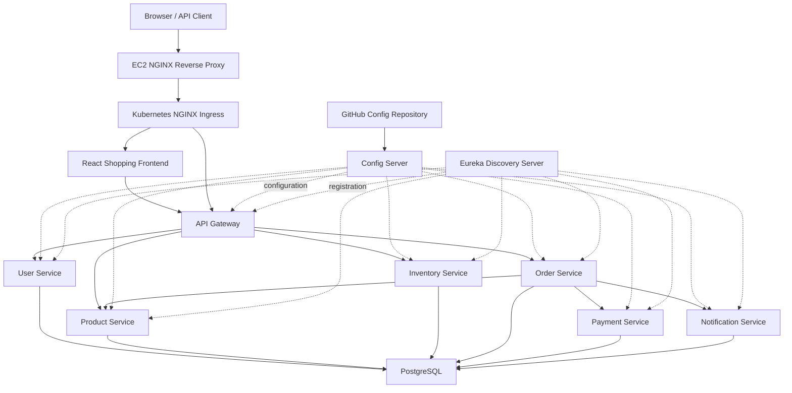
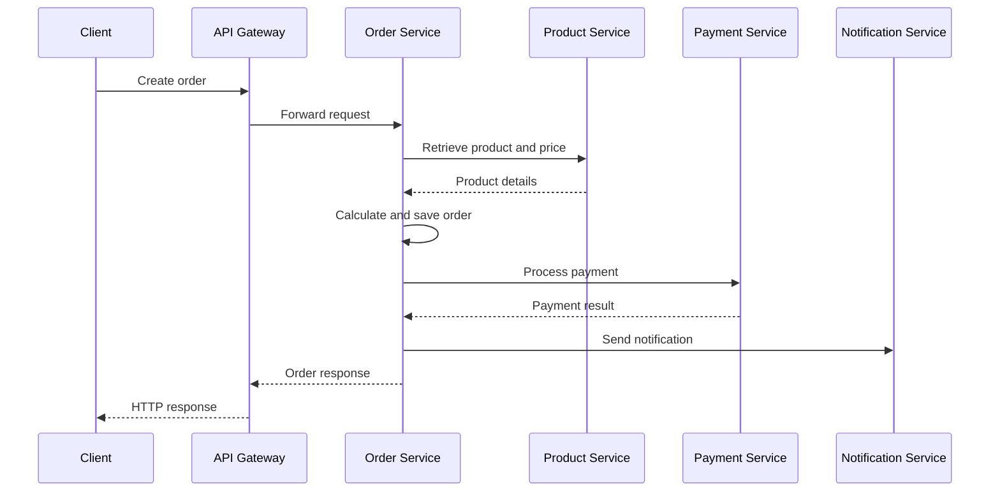
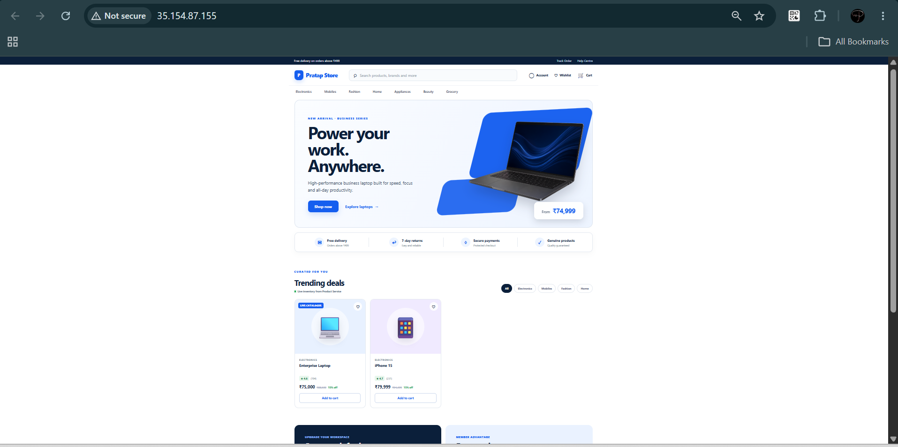
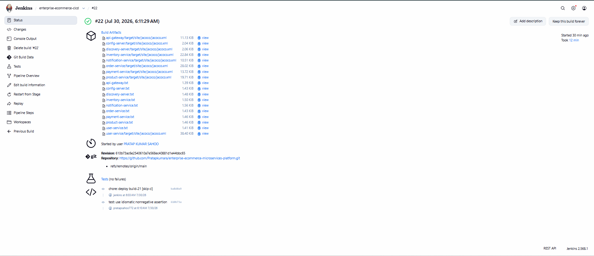
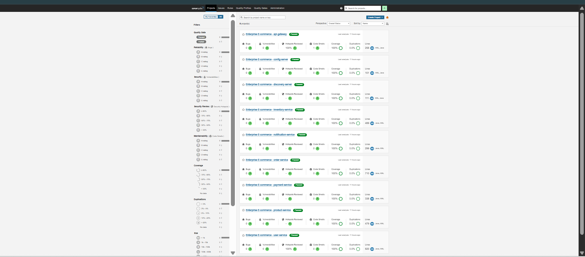
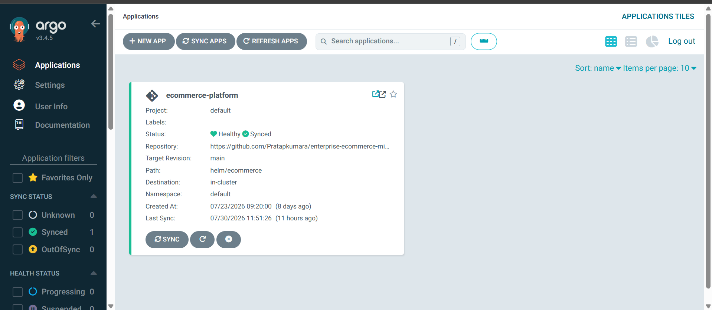
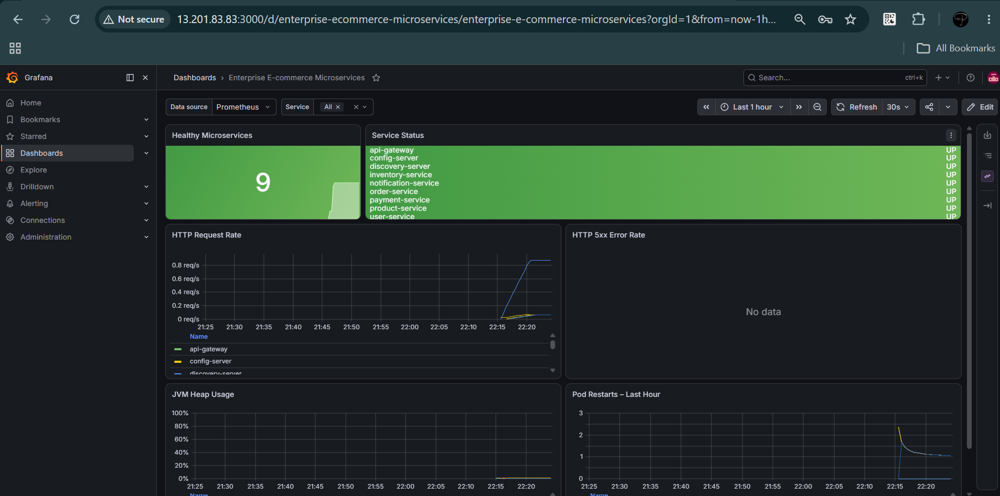
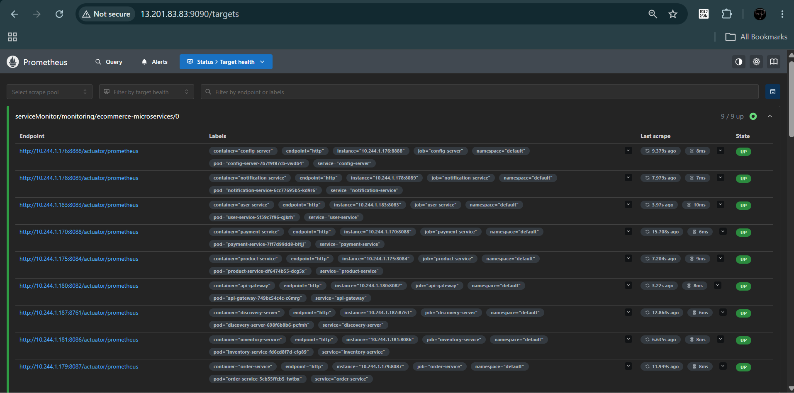
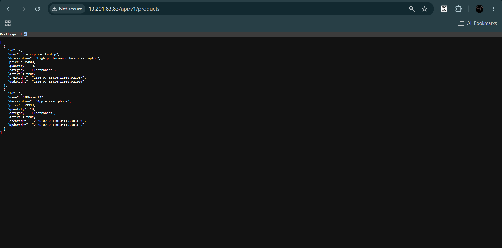

# Enterprise E-Commerce Microservices Platform

[](https://openjdk.org/)
[](https://spring.io/projects/spring-boot)
[](https://www.docker.com/)
[](https://kubernetes.io/)
[](https://helm.sh/)
[](https://www.jenkins.io/)
[](https://argo-cd.readthedocs.io/)
[](https://www.sonarsource.com/products/sonarqube/)
[](https://prometheus.io/)
[](https://grafana.com/)
[](https://www.postgresql.org/)

A production-style full-stack e-commerce application built with React, Spring Boot microservices, and a complete DevSecOps delivery platform on AWS EC2.

This project demonstrates a live shopping catalogue, service discovery, Git-backed centralized configuration, API Gateway routing, JWT security, PostgreSQL persistence, automated testing, static analysis, container security scanning, Kubernetes orchestration, Helm packaging, Argo CD GitOps, and full-stack observability.

## Live Application

The React shopping frontend is deployed on AWS EC2 and retrieves live catalogue data through the API Gateway and Product Service.

- Application: [http://35.154.87.155](http://35.154.87.155)
- Frontend release: `ecommerce-frontend:1.2`
- Latest verified Git revision: `245bded`
- Website status: HTTP `200`
- Product API status: HTTP `200`

> The public URL uses an EC2 public IP and may change when the instance is stopped and started.

## Project Status

| Area | Verified result |
|---|---|
| Platform components | React frontend and 9 backend components |
| Frontend release | `1.2` |
| Backend CI/CD release | `build-22` |
| Kubernetes workloads | Running and Ready |
| Jenkins pipeline | Successful |
| Argo CD application | Synced and Healthy |
| SonarQube analysis | Quality Gates passed |
| Product Service coverage | 87.1% |
| Product Service tests | 19 |
| Verified bugs | 0 |
| Verified vulnerabilities | 0 |
| Trivy image scanning | Integrated into CI/CD |
| Prometheus targets | Up |
| Grafana dashboard | Configured |
| Public shopping website | HTTP 200 |
| Public Product API | HTTP 200 |
| Frontend health endpoint | UP |

## GitHub Repositories

The platform uses two GitHub repositories:

| Repository | Purpose |
|---|---|
| [enterprise-ecommerce-microservices-platform](https://github.com/Pratapkumara/enterprise-ecommerce-microservices-platform) | Microservices, Jenkins pipeline, Dockerfiles, Kubernetes resources, Helm chart, Argo CD application, monitoring resources, documentation, and screenshots |
| [config-repository](https://github.com/Pratapkumara/config-repository) | Externalized Spring Cloud Config files consumed by Config Server |

Configuration repository structure:

```text
config-repository/
├── application.yml
├── discovery-server.yml
├── api-gateway.yml
├── user-service.yml
├── product-service.yml
├── inventory-service.yml
├── order-service.yml
├── payment-service.yml
└── notification-service.yml
```

## Architecture



## Platform Components

| Component | Port | Responsibility |
|---|---:|---|
| React Frontend | 80 | Shopping catalogue, category filters, pricing, and cart interface |
| Discovery Server | 8761 | Eureka service registration and discovery |
| Config Server | 8888 | Centralized configuration from the Git configuration repository |
| API Gateway | 8082 | Routing, JWT validation, and platform entry point |
| User Service | 8083 | Registration, login, JWT, and user management |
| Product Service | 8084 | Product catalogue and CRUD operations |
| Inventory Service | 8086 | Stock availability, reservation, and release |
| Order Service | 8087 | Order creation, totals, items, and status |
| Payment Service | 8088 | Payment processing and transaction records |
| Notification Service | 8089 | Order and payment notifications |

## Technology Stack

### Frontend

- React
- TypeScript
- Vite
- NGINX
- Responsive shopping interface
- Live Product Service integration

### Backend

- Java 21
- Spring Boot 3.5
- Spring Cloud
- Spring Cloud Config
- Netflix Eureka
- Spring Cloud Gateway Server Web MVC
- Spring Security and JWT
- Spring Data JPA and Hibernate
- OpenFeign
- Resilience4j
- Maven

### Database

- PostgreSQL 17
- Service-specific logical databases
- Persistent Kubernetes volumes

### DevOps and Cloud

- AWS EC2
- Docker
- Kubernetes with Minikube
- Helm
- Jenkins
- Argo CD
- NGINX Ingress Controller
- NGINX reverse proxy

### Quality and Security

- JUnit
- Mockito
- JaCoCo
- SonarQube
- Trivy
- Jenkins Quality Gates

### Monitoring

- Spring Boot Actuator
- Micrometer
- Prometheus
- Grafana
- Alertmanager
- kube-state-metrics
- Node Exporter

## Core Features

- Responsive React and TypeScript shopping frontend
- Live product catalogue loaded through the API Gateway
- Category filters, ratings, pricing, discounts, and cart interface
- Microservice-based backend architecture
- Dynamic service discovery through Eureka
- Git-backed centralized configuration
- API Gateway routing and edge security
- JWT-based authentication and authorization
- BCrypt password hashing
- Product catalogue management
- Inventory reservation and release
- Multi-item order processing
- Inter-service communication using OpenFeign
- Payment processing integration
- Automatic notification flow
- PostgreSQL persistence
- Circuit breaker and retry support
- Docker containerization
- Kubernetes deployment
- Helm release management
- Argo CD automated GitOps synchronization
- Jenkins CI/CD automation
- SonarQube quality analysis
- Trivy image vulnerability scanning
- Prometheus metrics, Grafana dashboards, and alerts

## Order Processing Flow



## API Endpoints

### Authentication and Users

| Method | Endpoint | Access |
|---|---|---|
| POST | `/api/v1/users/register` | Public |
| POST | `/api/v1/auth/login` | Public |
| GET | `/api/v1/users` | JWT protected |
| GET | `/api/v1/users/{id}` | JWT protected |
| PUT | `/api/v1/users/{id}` | JWT protected |
| DELETE | `/api/v1/users/{id}` | JWT protected |

### Products

| Method | Endpoint | Purpose |
|---|---|---|
| POST | `/api/v1/products` | Create product |
| GET | `/api/v1/products` | List products |
| GET | `/api/v1/products/{id}` | Get product |
| PUT | `/api/v1/products/{id}` | Update product |
| DELETE | `/api/v1/products/{id}` | Delete product |

### Inventory

| Method | Endpoint | Purpose |
|---|---|---|
| GET | `/api/inventory/{productId}` | Check inventory |
| POST | `/api/inventory/reserve` | Reserve stock |
| POST | `/api/inventory/release` | Release stock |

### Orders

| Method | Endpoint | Purpose |
|---|---|---|
| POST | `/api/orders` | Create order |
| GET | `/api/orders` | List orders |
| GET | `/api/orders/{id}` | Get order |
| PUT | `/api/orders/{id}/status` | Update order status |

### Notifications

| Method | Endpoint | Purpose |
|---|---|---|
| POST | `/api/notifications` | Create notification |
| GET | `/api/notifications` | List notifications |
| GET | `/api/notifications/user/{userId}` | Get user notifications |

## CI/CD Pipeline

The Jenkins pipeline automates:

1. Workspace cleanup and Git checkout
2. Tool validation
3. Maven compilation and unit tests
4. JaCoCo coverage report generation
5. SonarQube analysis
6. Quality Gate enforcement
7. Docker image builds
8. Trivy container image scans
9. Image loading into Minikube
10. Helm deployment or upgrade
11. Kubernetes rollout verification
12. Argo CD synchronization checks
13. Actuator health checks
14. NGINX Product API smoke test

## Kubernetes and Helm

Helm chart:

```text
helm/ecommerce/
├── Chart.yaml
├── values.yaml
└── templates/
```

Deploy or upgrade:

```bash
helm dependency update helm/ecommerce

helm upgrade --install ecommerce \
  helm/ecommerce \
  --namespace default
```

Verify:

```bash
kubectl get pods -n default
kubectl get svc -n default
kubectl get ingress -n default
```

## Argo CD GitOps

The Argo CD application tracks the `main` branch and deploys the Helm chart from the main repository.

```bash
kubectl apply -f argocd/ecommerce-application.yaml
kubectl get applications -n argocd
```

Expected state:

```text
NAME                 SYNC STATUS   HEALTH STATUS
ecommerce-platform   Synced        Healthy
```

GitOps features:

- Automated synchronization
- Self-healing
- Resource pruning
- Git as the deployment source of truth

## Monitoring and Alerting

Application observability endpoints:

```text
/actuator/health
/actuator/info
/actuator/prometheus
```

Monitoring resources include Prometheus, Grafana, Alertmanager, Prometheus Operator, kube-state-metrics, Node Exporter, ServiceMonitor, and PrometheusRule.

Configured alerts include:

- Service metrics unavailable
- Kubernetes deployment unavailable
- Frequent pod restarts
- High JVM heap usage
- HTTP server errors

## Code Quality and Security

The CI/CD pipeline runs:

- Unit tests
- JaCoCo coverage reporting
- SonarQube static analysis
- SonarQube Quality Gates
- Trivy container image scanning

SonarQube evaluates bugs, vulnerabilities, security hotspots, code smells, test coverage, and duplicated code.

Security controls include:

- Stateless JWT authentication
- BCrypt password hashing
- Protected user endpoints
- Public registration and login endpoints
- Security response headers
- Kubernetes service isolation
- Credentials excluded from source control

> Never commit JWT tokens, passwords, Jenkins credentials, SonarQube tokens, private keys, or cloud credentials.

## Repository Structure

```text
enterprise-ecommerce-microservices-platform/
├── frontend/
├── api-gateway/
├── config-server/
├── discovery-server/
├── user-service/
├── product-service/
├── inventory-service/
├── order-service/
├── payment-service/
├── notification-service/
├── argocd/
├── helm/
├── k8s/
├── kubernetes/
├── monitoring/
├── screenshots/
├── Jenkinsfile
└── README.md
```

## Local Development

### Prerequisites

- Git
- Java 21
- Maven 3.9+
- Docker
- PostgreSQL

### Clone Both Repositories

```bash
git clone \
  https://github.com/Pratapkumara/enterprise-ecommerce-microservices-platform.git

git clone \
  https://github.com/Pratapkumara/config-repository.git
```

The Config Server must be configured to read from the configuration repository.

### Recommended Startup Order

1. PostgreSQL
2. Discovery Server
3. Config Server
4. API Gateway
5. User Service
6. Product Service
7. Inventory Service
8. Payment Service
9. Notification Service
10. Order Service
11. React Frontend

Build one service:

```bash
cd product-service
mvn clean verify
```

Build all Maven services:

```bash
for service in \
  discovery-server config-server api-gateway user-service \
  product-service inventory-service order-service \
  payment-service notification-service
do
  mvn -B -ntp -f "$service/pom.xml" clean verify
done
```

## Runtime Verification

```bash
minikube status
kubectl get nodes
kubectl get pods -A
kubectl get applications -n argocd
```

Frontend and Product API smoke tests:

```bash
curl -i http://localhost/
curl -i http://localhost/api/v1/products
kubectl exec deployment/ecommerce-frontend -- wget -qO- http://127.0.0.1/health
```

Jenkins and SonarQube:

```bash
curl -I http://localhost:8080/login
curl http://localhost:9000/api/system/status
```

## Project Screenshots

### Live React Shopping Frontend



### Jenkins CI/CD Pipeline — Build #22 Success



### SonarQube — Code Quality and Test Coverage



### Argo CD — Synced and Healthy



### Grafana — E-Commerce Monitoring Dashboard



### Prometheus — Microservices Targets



### Product API — Successful Gateway Response



## Challenges Solved

- Migrated Spring Boot services from standalone processes to Kubernetes
- Resolved Config Server and Eureka connectivity issues
- Fixed API Gateway routing and JWT configuration problems
- Configured PostgreSQL persistence
- Resolved Docker and Minikube network IP conflicts
- Integrated Jenkins with the Minikube cluster
- Added unit tests and JaCoCo coverage reports
- Enforced SonarQube Quality Gates
- Added Trivy image vulnerability scanning
- Configured Prometheus ServiceMonitor resources
- Created Grafana dashboards and alert rules
- Implemented NGINX reverse proxy access
- Configured automated Helm deployment through Argo CD

## Key Learning Outcomes

- Spring Boot microservice design
- Secure REST API development
- Service discovery and centralized configuration
- Service-to-service communication
- Docker containerization
- Kubernetes orchestration
- Helm package management
- Jenkins CI/CD pipelines
- GitOps with Argo CD
- Code quality and security gates
- Monitoring and alerting
- AWS EC2 and Linux troubleshooting

## Future Enhancements

- Persistent shopping cart and checkout workflow
- Real payment gateway integration
- Kafka-based asynchronous events
- Redis caching
- OpenTelemetry distributed tracing
- Centralized logging
- Amazon EKS deployment
- Amazon RDS for PostgreSQL
- HTTPS with domain and TLS
- Horizontal Pod Autoscaling

## Author

**Pratap Kumar Sahoo**

- GitHub: [Pratapkumara](https://github.com/Pratapkumara)
- Main repository: [Enterprise E-Commerce Microservices Platform](https://github.com/Pratapkumara/enterprise-ecommerce-microservices-platform)
- Configuration repository: [config-repository](https://github.com/Pratapkumara/config-repository)
- Target role: AWS Cloud / DevOps Engineer
- Location: Odisha, India

## License

This project is intended for learning, portfolio demonstration, and technical evaluation.
