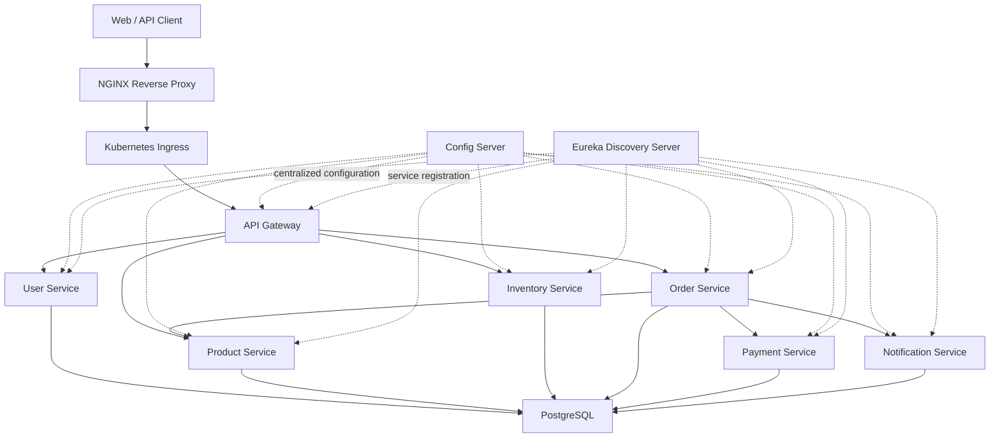
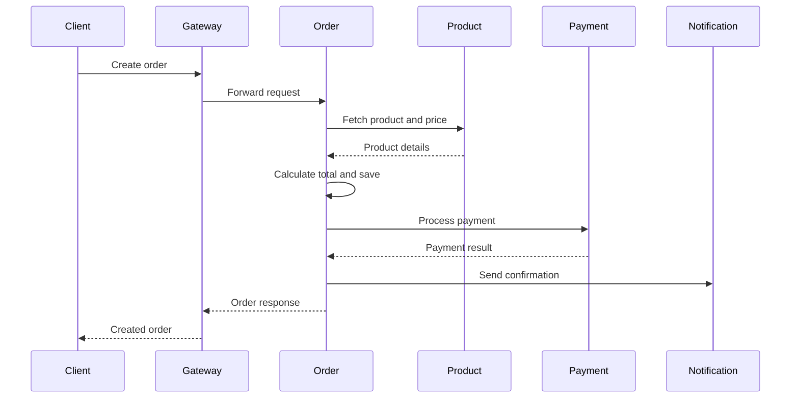

# Enterprise E-Commerce Microservices Platform

[](https://openjdk.org/)
[](https://spring.io/projects/spring-boot)
[](https://www.docker.com/)
[](https://kubernetes.io/)
[](https://helm.sh/)
[](https://www.jenkins.io/)
[](https://argo-cd.readthedocs.io/)
[](https://www.sonarsource.com/products/sonarqube/)
[](https://prometheus.io/)
[](https://grafana.com/)
[](https://www.postgresql.org/)

A production-style e-commerce backend built with Spring Boot microservices and a complete DevSecOps delivery platform.

The project demonstrates service discovery, centralized configuration, JWT security, synchronous service communication, PostgreSQL persistence, automated testing, static analysis, container security scanning, Kubernetes orchestration, Helm packaging, Argo CD GitOps deployment, and full-stack observability.

## Project Status

| Area | Result |
|---|---|
| Microservices | 9 services deployed |
| Latest verified release | `build-22` |
| Jenkins pipeline | Passed |
| Argo CD | Synced and Healthy |
| SonarQube Quality Gates | 9/9 Passed |
| Test coverage | 100% across all projects |
| Bugs | 0 |
| Vulnerabilities | 0 |
| Code smells | 0 |
| Security review | A |
| Duplications | 0.0% |
| Kubernetes health checks | 9/9 Passed |
| Trivy critical vulnerability gate | Passed |
| Public API smoke test | HTTP 200 |

## Architecture



## Microservices

| Service | Port | Responsibility |
|---|---:|---|
| Config Server | 8888 | Centralized externalized configuration |
| Discovery Server | 8761 | Eureka service registration and discovery |
| API Gateway | 8082 | Routing, edge security, and API entry point |
| User Service | 8083 | Registration, authentication, users, roles, and JWT |
| Product Service | 8084 | Product catalog and product CRUD |
| Inventory Service | 8086 | Stock, reservation, and release operations |
| Order Service | 8087 | Order creation, totals, orchestration, and status |
| Payment Service | 8088 | Payment processing and transaction records |
| Notification Service | 8089 | User and order notifications |

## Core Business Flow



## Technology Stack

### Backend

- Java 17 and Java 21
- Spring Boot 3.5.15
- Spring Cloud 2025.0.3
- Spring Security
- Spring Data JPA
- Spring Validation
- Spring Cloud OpenFeign
- Resilience4j
- MapStruct
- Lombok
- Maven

### Data and Security

- PostgreSQL
- H2 for isolated tests
- JWT Bearer authentication
- BCrypt password encoding
- Stateless Spring Security
- Role-based authorization

### DevSecOps

- Git and GitHub
- Jenkins declarative pipeline
- Maven and JaCoCo
- SonarQube Quality Gates
- Docker and Docker Compose
- Trivy image scanning
- Kubernetes and Minikube
- Helm
- Argo CD
- NGINX Ingress and reverse proxy

### Observability

- Spring Boot Actuator
- Micrometer
- Prometheus
- Grafana
- Alertmanager
- kube-state-metrics
- Node Exporter

## CI/CD and GitOps Pipeline

```mermaid
flowchart LR
    Git["GitHub"] --> Jenkins["Jenkins"]
    Jenkins --> Tests["Build + Tests + JaCoCo"]
    Tests --> Sonar["SonarQube Gates"]
    Sonar --> Images["Docker Images"]
    Images --> Trivy["Trivy Scan"]
    Trivy --> Minikube["Import to Minikube"]
    Minikube --> Helm["Update Helm Tags"]
    Helm --> GitOps["Push GitOps Commit"]
    GitOps --> Argo["Argo CD Sync"]
    Argo --> Smoke["Health + Smoke Tests"]
```



The Jenkins pipeline performs:

1. Source checkout
2. Infrastructure and connectivity validation
3. Maven build and unit tests for every service
4. JaCoCo XML coverage report generation
5. SonarQube analysis per service
6. Quality Gate enforcement per service
7. Docker image creation
8. Trivy critical-vulnerability scanning
9. Image import into Minikube
10. Dynamic Helm image-tag updates
11. Helm linting and template validation
12. GitOps commit and push
13. Argo CD deployment synchronization
14. Kubernetes rollout verification
15. Service health checks and smoke tests
16. Artifact archiving and workspace cleanup

The pipeline stops immediately if any test, Quality Gate, security scan, rollout, or health check fails.

## SonarQube Quality Results

| Project | Coverage | Bugs | Vulnerabilities | Code Smells | Duplications |
|---|---:|---:|---:|---:|---:|
| Config Server | 100% | 0 | 0 | 0 | 0.0% |
| Discovery Server | 100% | 0 | 0 | 0 | 0.0% |
| API Gateway | 100% | 0 | 0 | 0 | 0.0% |
| User Service | 100% | 0 | 0 | 0 | 0.0% |
| Product Service | 100% | 0 | 0 | 0 | 0.0% |
| Inventory Service | 100% | 0 | 0 | 0 | 0.0% |
| Order Service | 100% | 0 | 0 | 0 | 0.0% |
| Payment Service | 100% | 0 | 0 | 0 | 0.0% |
| Notification Service | 100% | 0 | 0 | 0 | 0.0% |

Security Hotspots were reviewed in the context of stateless REST APIs using Bearer JWT authentication and `SessionCreationPolicy.STATELESS`.

## Kubernetes and Helm

The platform is packaged as a Helm application chart:

```text
helm/ecommerce
├── Chart.yaml
├── values.yaml
└── templates
```

Chart metadata:

| Property | Value |
|---|---|
| Chart name | `ecommerce` |
| Chart version | `1.0.0` |
| Application version | `1.0` |
| PostgreSQL dependency | Bitnami PostgreSQL `18.8.0` |

Validate the chart:

```bash
helm dependency update helm/ecommerce
helm lint helm/ecommerce
helm template ecommerce helm/ecommerce
```

Install or upgrade:

```bash
helm upgrade --install ecommerce \
  helm/ecommerce \
  --namespace default \
  --create-namespace
```

Check workloads:

```bash
kubectl get nodes
kubectl get pods
kubectl get services
kubectl get ingress
```

## Argo CD GitOps

The Argo CD application is defined in:

```text
argocd/ecommerce-application.yaml
```

Apply it:

```bash
kubectl apply -f argocd/ecommerce-application.yaml
```

Check status:

```bash
kubectl get applications -n argocd
```

Expected state:

```text
NAME                 SYNC STATUS   HEALTH STATUS
ecommerce-platform   Synced        Healthy
```

The application uses:

- Repository: `Pratapkumara/enterprise-ecommerce-microservices-platform`
- Branch: `main`
- Source path: `helm/ecommerce`
- Automated synchronization
- Pruning
- Self-healing

## Monitoring and Alerts

The `monitoring` directory contains:

```text
monitoring
├── application-servicemonitor.yaml
├── ecommerce-alert-rules.yaml
├── ecommerce-dashboard.json
└── namespace.yaml
```

Prometheus scrapes Spring Boot Actuator metrics from the microservices through `/actuator/prometheus`.

Configured alert scenarios include:

- Service metrics unavailable
- Kubernetes deployment unavailable
- Frequent pod restarts
- High JVM heap usage
- HTTP 5xx responses

Useful checks:

```bash
kubectl get pods -n monitoring
kubectl get servicemonitors -A
kubectl get prometheusrules -A
```

## Main API Endpoints

| Capability | Method | Endpoint |
|---|---|---|
| Register user | POST | `/api/v1/users/register` |
| Login | POST | `/api/v1/auth/login` |
| List users | GET | `/api/v1/users` |
| List products | GET | `/api/v1/products` |
| Product operations | CRUD | `/api/products` |
| Inventory operations | CRUD | `/api/inventory` |
| Reserve stock | POST | `/api/inventory/{productId}/reserve?quantity={n}` |
| Release stock | POST | `/api/inventory/{productId}/release?quantity={n}` |
| Create order | POST | `/api/orders` |
| List orders | GET | `/api/orders` |
| Process payment | POST | `/api/payments` |
| Create notification | POST | `/api/notifications` |
| User notifications | GET | `/api/notifications/user/{userId}` |
| Service health | GET | `/actuator/health` |
| Prometheus metrics | GET | `/actuator/prometheus` |

Exact public paths depend on the API Gateway routing configuration and active deployment profile.

## Example Product API Test

```bash
curl -i http://localhost/api/v1/products
```

Expected:

```text
HTTP/1.1 200
Content-Type: application/json
```

## Running Tests and Coverage Locally

Run tests for one service:

```bash
cd product-service
mvn clean verify
```

Run all services:

```bash
for service in \
config-server discovery-server api-gateway user-service \
product-service inventory-service order-service \
payment-service notification-service
do
  mvn -f "$service/pom.xml" clean verify
done
```

JaCoCo reports are generated at:

```text
<service>/target/site/jacoco/index.html
<service>/target/site/jacoco/jacoco.xml
```

## Local Development

### Prerequisites

- Git
- Java 17 and/or Java 21
- Maven 3.9+
- Docker
- Docker Compose
- PostgreSQL
- kubectl
- Helm
- Minikube

### Clone

```bash
git clone \
https://github.com/Pratapkumara/enterprise-ecommerce-microservices-platform.git

cd enterprise-ecommerce-microservices-platform
```

### Configuration

The services use Spring Cloud Config. Keep sensitive values outside source control and provide them through:

- Environment variables
- Kubernetes Secrets
- Jenkins credentials
- A protected configuration repository

Never commit real passwords, private keys, access tokens, or production JWT secrets.

### Recommended Startup Order

1. PostgreSQL
2. Discovery Server
3. Config Server
4. API Gateway
5. User Service
6. Product Service
7. Inventory Service
8. Payment Service
9. Notification Service
10. Order Service

Example:

```bash
mvn -f discovery-server/pom.xml spring-boot:run
mvn -f config-server/pom.xml spring-boot:run
```

For a full deployment, Helm and Argo CD are the recommended paths.

## Repository Structure

```text
.
├── api-gateway
├── config-server
├── discovery-server
├── user-service
├── product-service
├── inventory-service
├── order-service
├── payment-service
├── notification-service
├── helm/ecommerce
├── argocd
├── monitoring
├── kubernetes
├── k8s
├── cicd
├── docker
├── screenshots
├── Jenkinsfile
└── README.md
```

## Resilience and Security

- Stateless JWT authentication
- BCrypt password hashing
- Spring Security filter chain
- Role-based access control
- Resilience4j circuit breaker and retry
- Notification fallback with structured logging
- Typed exception responses
- Dedicated domain exceptions
- Immutable security constants
- Kubernetes self-healing
- Argo CD drift correction
- CI-enforced SonarQube and Trivy gates

## Verified Deployment

The latest verified release is `build-22`.

Verification completed through:

- Kubernetes pod readiness checks
- Deployment rollout checks
- Argo CD synchronization
- Service Actuator health endpoints
- NGINX product API smoke test
- SonarQube project analysis
- Trivy image scans

## Screenshots

Create evidence screenshots in the `screenshots` directory using descriptive names:

```text
screenshots/
├── architecture.png
├── jenkins-build-22-success.png
├── sonarqube-projects-100-coverage.png
├── argocd-synced-healthy.png
├── grafana-dashboard.png
├── prometheus-targets.png
└── product-api-response.png
```

After adding screenshots, embed them in this README using relative paths:

```markdown


```

## Key Learning Outcomes

This project demonstrates practical experience with:

- Designing and integrating Spring Boot microservices
- Building secure REST APIs with JWT
- Managing distributed configuration and discovery
- Implementing service-to-service communication
- Writing unit and integration tests
- Achieving CI-enforced code quality
- Building secure container images
- Packaging Kubernetes workloads with Helm
- Implementing GitOps with Argo CD
- Monitoring distributed applications
- Operating a complete platform on AWS EC2

## Future Enhancements

- React or Next.js shopping frontend
- Shopping cart and checkout services
- Kafka-based event-driven communication
- Distributed tracing with OpenTelemetry and Tempo
- Centralized logging with Loki or the ELK stack
- Cloud-managed Kubernetes deployment
- Managed PostgreSQL
- Horizontal Pod Autoscaling based on application metrics

## Author

**Pratap Kumar Sahoo**

- GitHub: [Pratapkumara](https://github.com/Pratapkumara)
- Project: [Enterprise E-Commerce Microservices Platform](https://github.com/Pratapkumara/enterprise-ecommerce-microservices-platform)

## License

This project is intended for learning, portfolio demonstration, and technical evaluation. Add an explicit open-source license before redistributing or accepting external contributions.
